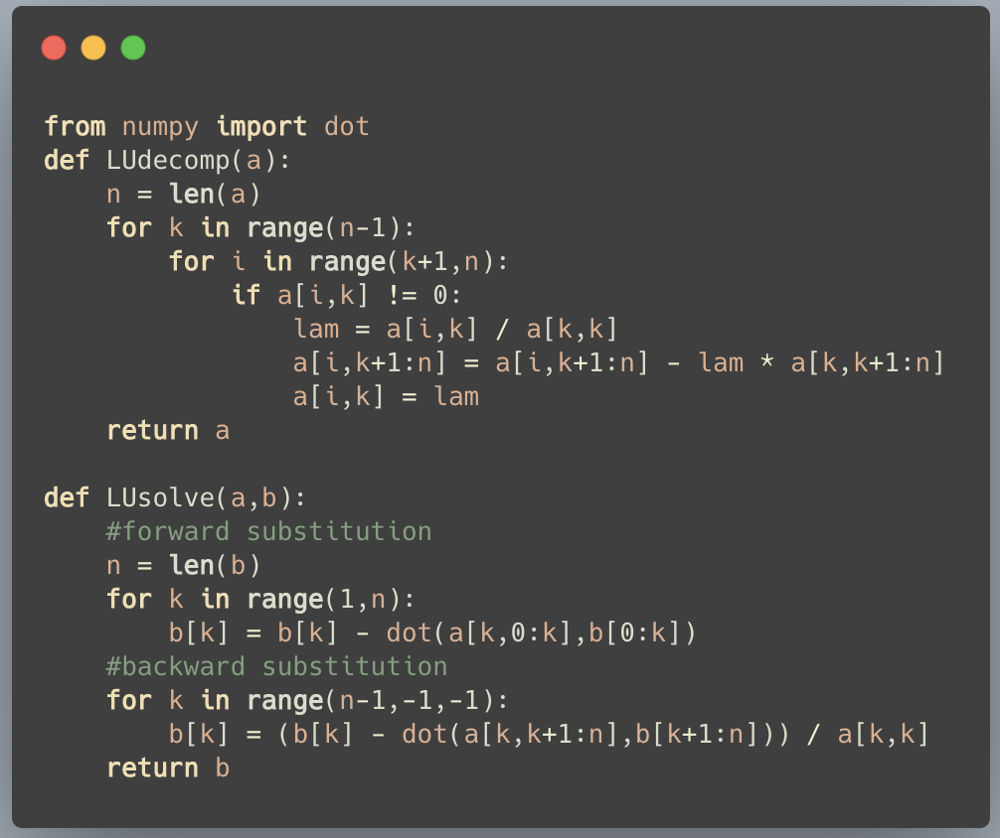
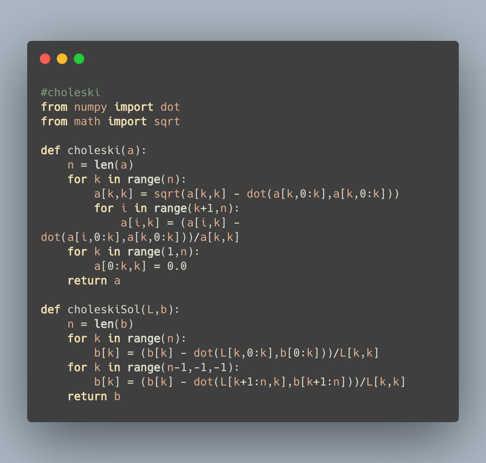
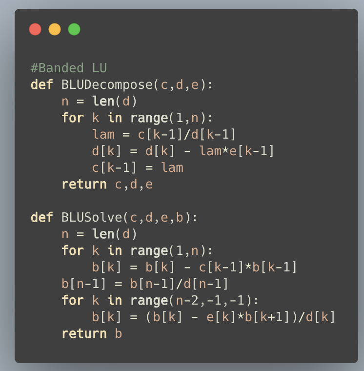
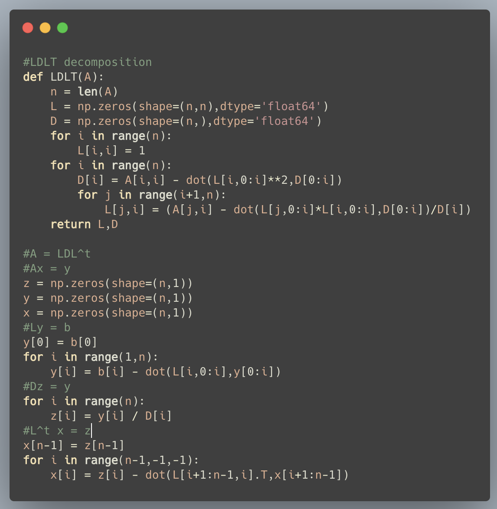
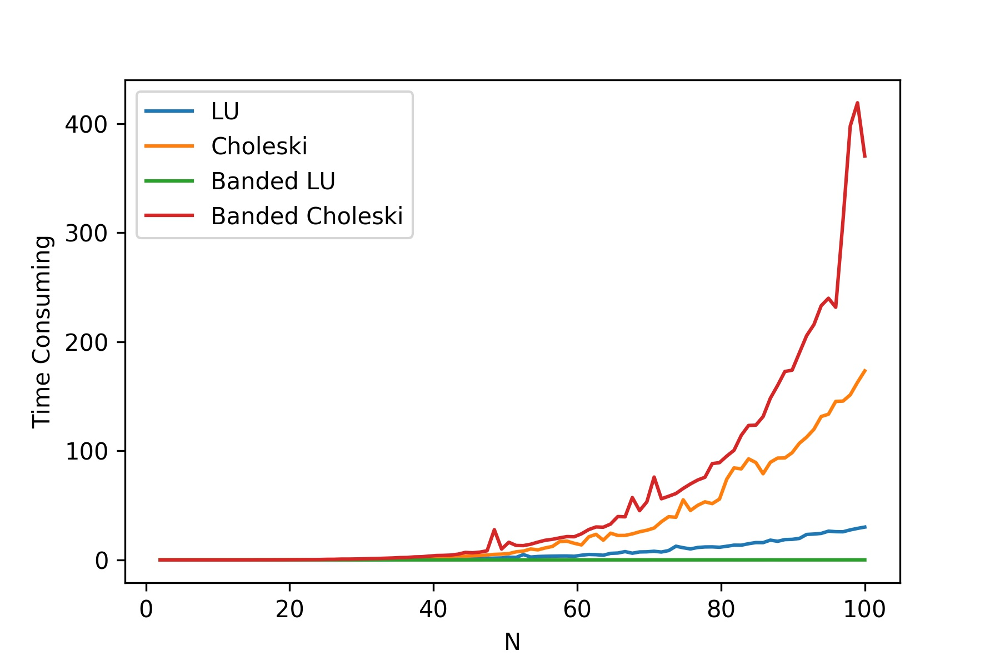
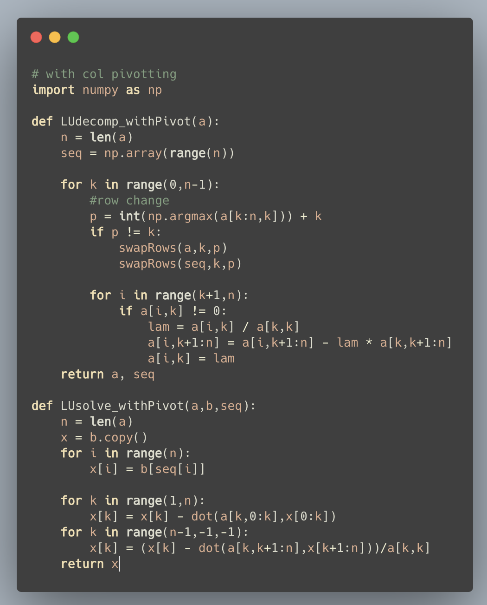
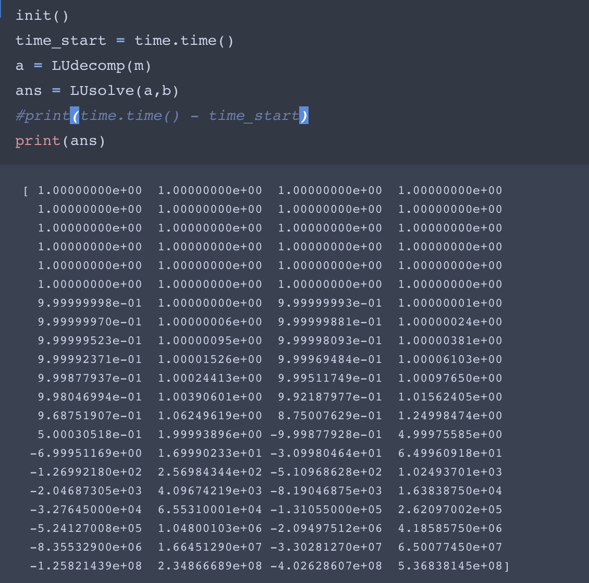
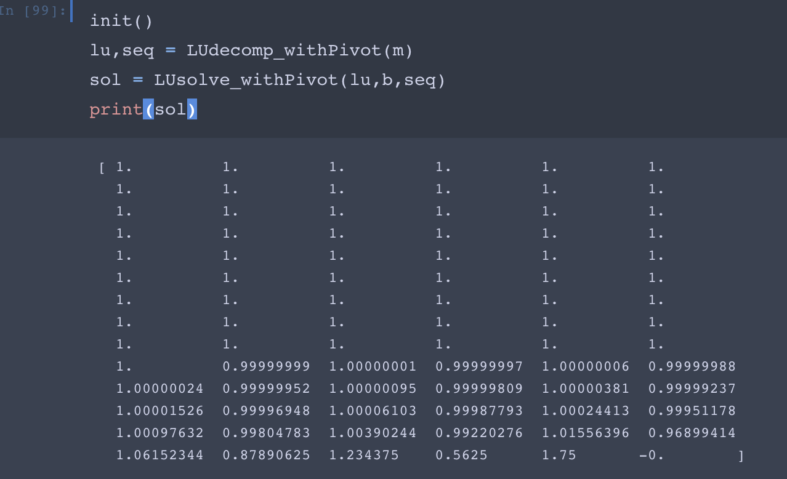

## Solving Poisson Equation with Numerical Method

We present a trivial FDM to obtain the approximating value of the Poisson equation with **different grid size**, then using different methods to solve the system. In this assignment, we use **LU-Decomposition, Choleski Decomposition, Banded LU-Decomposition and Banded Choleski Decomposition** to solve the system. Time analysis is also included in this assignment.

### LU Decomposition

This is the key code from the script, details can be found in the attachment.



### Choleski Decomposition



### Banded LU decomposition



### Banded Choleski



### Experimetal Result

We choose $2\le N \le 100$ as the hyper parameter to test the time complexity and record the time consuming during the solving process. The result is shown below.



## Book page 39 1, 2(2)

In this section, we use **pivoting** of LU Decompositon and Choleski Decomposition to solve different system including Hilbert Matrix.



The approximate solution **WITHOUT PIVOTING** is shown below.




**With Pivoting**




The error with pivoting is relatively low comparing to the NON-Pivoting LU method.


### Hilbert Matrix using choleski Decomposition

Hilbert Matrix is known as a **highly illed condition matrix**, I construct the matrix successfully, but I am not able to solve the high rank Hilbert Matrix with Choleski method, but can solve with **LDLT** decomposition.


```python
#LDLT decomposition
def LDLT(A):
    n = len(A)
    L = np.zeros(shape=(n,n),dtype='float64')
    D = np.zeros(shape=(n,),dtype='float64')
    for i in range(n):
        L[i,i] = 1
    for i in range(n):
        D[i] = A[i,i] - dot(L[i,0:i]**2,D[0:i])
        for j in range(i+1,n):
            L[j,i] = (A[j,i] - dot(L[j,0:i]*L[i,0:i],D[0:i])/D[i])
    return L,D
  
L,D = LDLT(hil) #noted the Rank 40 Hilbert matrix as hil.
n = len(D)
z = np.zeros(shape=(n,1))
y = np.zeros(shape=(n,1))
x = np.zeros(shape=(n,1))
#Ly = b
y[0] = b[0]
for i in range(1,n):
    y[i] = b[i] - dot(L[i,0:i],y[0:i])
#Dz = y
for i in range(n):
    z[i] = y[i] / D[i]
#L^t x = z
x[n-1] = z[n-1]
for i in range(n-1,-1,-1):
    x[i] = z[i] - dot(L[i+1:n-1,i].T,x[i+1:n-1])
```

